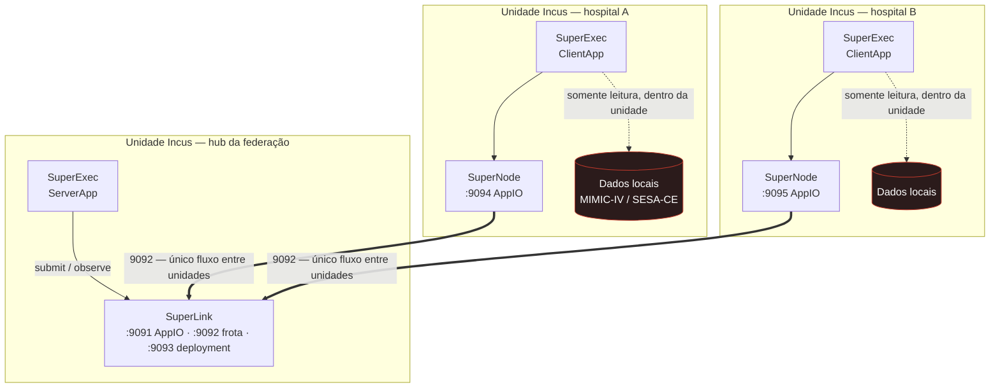
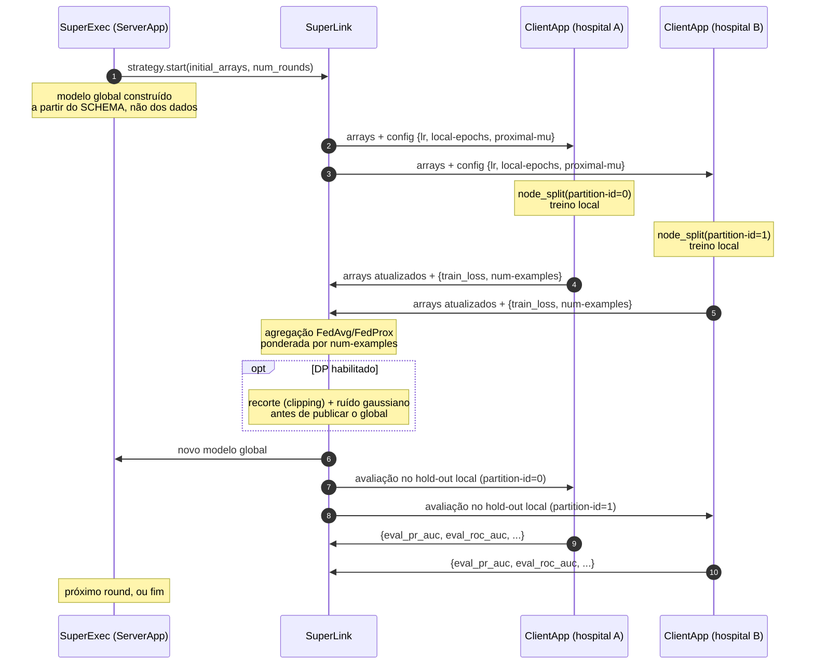
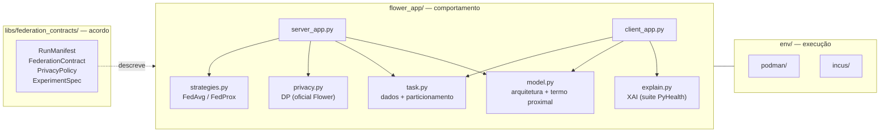
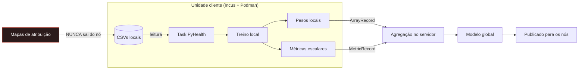

# Arquitetura

Documento de referência da camada de federação. Descreve a topologia, o caminho
de um round federado, a fronteira de dados e onde cada requisito do projeto
(non-IID, privacidade, explicabilidade, validação externa) está implementado.

## 1. Visão geral

O sistema treina um modelo de alerta antecipado de deterioração clínica sem
centralizar prontuários. Cada instituição mantém seus registros localmente e
troca apenas **parâmetros de modelo** e **escalares de métrica**.

Há dois runtimes, e o mesmo código de aplicação roda nos dois:

| Runtime | Quando usar | Onde o código roda |
| --- | --- | --- |
| **Simulation Runtime** (Ray) | Desenvolvimento, reprodução de experimentos, varredura de hiperparâmetros | Processos locais geridos pelo Ray |
| **Deployment Runtime** | Exercitar a pilha real de comunicação; base para o rollout multi-instituição | SuperLink + SuperNodes + SuperExecs em contêineres |

Essa escolha é o motivo de a aplicação ser escrita no modelo `ServerApp`/`ClientApp`
do Flower: os objetos são **idênticos** nos dois runtimes, então alternar entre
simulação e deployment não exige mudança de código.

## 2. Topologia de componentes

**Regra de fronteira:** o único fluxo que cruza unidades é `SuperNode → SuperLink:9092`.
O inventário completo de portas e quais podem ser expostas está em
`env/incus/PORTS.md`.

## 3. Um round federado

## 4. Onde cada requisito vive

| Requisito do projeto | Onde está implementado | Como é verificado |
| --- | --- | --- |
| Heterogeneidade **non-IID** | `task.shard` / `partition_patient_ids` com os esquemas `uniform` e `label-skew` | `tests/test_partitioning.py`, `test_pipeline.py::test_label_skew_*` |
| **DP** como requisito arquitetural | `privacy.maybe_wrap_dp` envolve a estratégia com os mecanismos oficiais do Flower | `tests/test_strategies_privacy.py` |
| **XAI** | `explain.py` sobre a suíte `pyhealth.interpret` (`IntegratedGradients`, `DeepLift`, `GIM`, `LIMe`, `SHAP`, `Chefer`) | `test_pipeline.py::test_interpretability_*` |
| **Validação federada vs centralizada** | Hold-out compartilhado, nunca treinado, em `task.node_split`; comparado por `scripts/central_baseline.py` | asserção de hold-out idêntico no próprio script |
| **Auditoria / governança** | `libs/federation_contracts` serializa o que foi acordado e executado | `tests/test_contracts.py` |

## 5. Fronteira de dados

O que **cruza** o limite do nó, exaustivamente:

* `ArrayRecord` — pesos do modelo;
* `MetricRecord` — escalares (`train_loss`, `num-examples`, `eval_pr_auc`, …).

O que **nunca** cruza: amostras, `visit_id`, `patient_id`, mapas de atribuição
(XAI), checkpoints intermediários. Os mapas de atribuição apontam para códigos e
internações individuais, portanto são dado derivado de paciente e permanecem
dentro da unidade.

## 6. Decisões e justificativas

| Decisão | Escolha | Justificativa |
| --- | --- | --- |
| Runtime de desenvolvimento | Simulation Runtime (Ray) | É o modo padrão de `flwr run`; o backend é o `RayBackend`. Permite varrer esquemas de partição e orçamentos de privacidade sem infraestrutura. |
| Agregação baseline | `FedAvg` | McMahan et al., *Communication-Efficient Learning of Deep Networks from Decentralized Data*, AISTATS 2017. |
| Agregação para non-IID | `FedProx` | Li et al., *Federated Optimization in Heterogeneous Networks*, MLSys 2020. O termo proximal existe justamente para o regime que `label-skew` produz. |
| Onde aplicar o termo proximal | `forward()` do modelo | `pyhealth.trainer.Trainer` lê `output["loss"]` direto do modelo e não usa `get_loss_function`; envolver `forward` preserva métricas, early stopping e reload do melhor checkpoint do PyHealth. |
| Mecanismo de DP | `DifferentialPrivacyServerSideFixedClipping` | Já vem no Flower 1.34; não requer alteração no cliente. Ver a ressalva de confiança em `privacy.py`. |
| Partição por paciente, não por amostra | `task.node_split` | Um paciente pode ter várias internações. Particionar por amostra colocaria internações do mesmo paciente em nós diferentes — vazamento entre nós. |
| Split implementado localmente | não usar `split_by_patient` | Os subsets retornados por `split_by_patient` não expõem mapeamento utilizável: `patient_to_index` continua listando **todos** os pacientes, e os índices inteiros são rebaseados para o subset. As duas propriedades tornam fácil construir um split que vaza sem parecer errado. Ver o docstring de `task.py`. |
| `partition-id` obrigatório | erro explícito se ausente | Em simulação, `node_id` é um identificador de 64 bits (ex.: `6677547757711064239`), não um índice. Assumir `0` faria todos os nós treinarem na mesma partição e ainda assim reportarem resultado "federado". |
| Hold-out compartilhado | pool de teste nunca particionado | Sem ele não existe base comum para comparar modelo federado e centralizado. |
| Configuração de DP desligada por padrão | `dp-mode = "none"` | Ligar DP muda os números. O orçamento de privacidade deve ser escolha registrada, nunca default silencioso. |

## 7. Limitações conhecidas

* **O demo tem 100 pacientes.** Após o split, o pool de validação tem 4 pacientes
  e o hold-out, 5. As métricas são ruidosas por construção: o demo serve para
  exercitar o pipeline, não para conclusão estatística. Escale com
  `PYHEALTH_EHR_ROOT` apontando para o MIMIC-IV credenciado completo.
* **DP central.** O servidor vê as atualizações individuais antes de agregar. Um
  cenário que não confie no servidor exige recorte no cliente mais agregação
  segura, ambos fora do escopo do protótipo.
* **Sem agregação segura.** Não implementada; ver acima.
* **`--insecure` no deployment.** Os certificados são gerados por
  `env/podman/certs.yml`, mas ainda não estão em uso.
* **Sem Split Learning.** Está no plano de trabalho como terceira estratégia e
  não está implementado.
