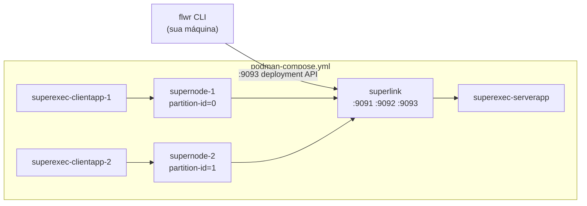

# Deployment (Deployment Runtime em contêineres)

Este modo exercita a pilha real de comunicação do Flower dentro de contêineres.
É a base sobre a qual o rollout multi-instituição (Incus + Podman) é construído.

Ele **não** é necessário para reproduzir experimentos — para isso use
`docs/SIMULATION.md`, que é muito mais barato.

## Topologia



Cinco processos: um `SuperLink`, dois `SuperNode` e três `SuperExec` (um
ServerApp, dois ClientApps). A imagem dos SuperExec é a mesma para os três;
o que muda é `--plugin-type`.

## Pré-requisitos

* Podman e um provider de compose: `podman compose` ou `podman-compose`;
* os dados MIMIC-IV em `data/`, versionados no repositório (demo ODbL).

## 1. Construir e subir

```bash
scripts/deploy_containers.sh up
```

Equivalente a:

```bash
podman build -f Containerfile.superexec -t pyhealth-flower-superexec:0.1.0 .
podman compose -f podman-compose.yml up -d --build
```

> A `Containerfile.superexec` remove a linha de dependência do Flower antes do
> `pip install`, porque a imagem base `flwr/superexec:1.34.0` já traz o Flower.
> Como o projeto declara `flwr[simulation,dp]`, o `sed` casa o prefixo `"flwr[`.
> Se você adicionar outra linha de dependência do Flower, ajuste o `sed` junto.

## 2. Configurar a conexão de deployment

O CLI precisa saber onde está o SuperLink. Confira:

```bash
flwr config list
```

Se `local-deployment` não aparecer, adicione em `~/.flwr/config.toml`:

```toml
[superlink.local-deployment]
address = "127.0.0.1:9093"
insecure = true
```

## 3. Submeter a aplicação

```bash
scripts/deploy_containers.sh run
```

Equivalente a:

```bash
flwr run . local-deployment --stream
```

Os `partition-id` vêm do `--node-config` de cada SuperNode no compose, então o
`ClientApp` não precisa adivinhar nada.

## 4. Acompanhar e encerrar

```bash
scripts/deploy_containers.sh logs
scripts/deploy_containers.sh down
```

## Portas

| Porta | Serviço | Cruza fronteira de unidade? |
| ---: | --- | --- |
| `9091` | SuperLink AppIO | Não |
| `9092` | Conexão da frota SuperNode → SuperLink | **Sim**, apenas de unidades cliente |
| `9093` | API de deployment do CLI | Não — somente rede de administração |
| `9094` | SuperNode-1 AppIO | Não |
| `9095` | SuperNode-2 AppIO | Não |

O `podman-compose.yml` publica todas as cinco no host. Isso está **correto para
desenvolvimento em uma máquina só** e está **errado para multi-unidade**: nesse
caso somente `9092` deve ser alcançável entre unidades e `9093` apenas pela rede
de administração. O detalhamento e os trechos a alterar estão em
`env/incus/PORTS.md`.

## Transporte seguro

O compose roda com `--insecure`. Para gerar o material TLS:

```bash
podman compose -f env/podman/certs.yml run --rm gen-certs
```

A saída vai para `env/podman/superlink-certificates/`, que é ignorado pelo git.
**`ca.key` e `server.key` são segredos de federação**: quem os tiver pode se
passar pelo servidor de agregação e receber as atualizações de modelo.

Sair do `--insecure` é pré-requisito para qualquer deployment em que a federação
atravesse uma rede que a instituição não controla integralmente.

## Diferenças em relação ao Simulation Runtime

| | Simulation | Deployment |
| --- | --- | --- |
| Nós | Processos Ray locais | SuperNodes registrados no SuperLink |
| `partition-id` | Preenchido pelo Flower em `node_config` | Definido por `--node-config` |
| Transporte | Em processo | gRPC sobre a rede |
| Dados | Compartilham o mesmo diretório | Cada unidade tem os seus |
| Uso | Experimentos | Validar a comunicação; base do rollout |

## Diagnóstico

| Sintoma | Causa provável |
| --- | --- |
| `no such file or directory: 'flower-superlink'` | `.venv/bin` fora do `PATH` |
| `neither 'podman compose' nor 'podman-compose'` | Provider de compose ausente |
| `ClientApp` reclama de `partition-id` | `--node-config` do SuperNode sem `partition-id` |
| `ClientApp` reclama de split vazio | `num-partitions` maior que o número de pacientes disponíveis; reduza os nós ou use um coorte maior |
| `flwr run` não encontra a conexão | Falta a seção `[superlink.local-deployment]` |
| Treino com arquivos MIMIC ausentes | `PYHEALTH_EHR_ROOT` apontando para o lugar errado |

```bash
podman ps -a
podman compose -f podman-compose.yml logs superlink
podman compose -f podman-compose.yml logs supernode-1 supernode-2
```
